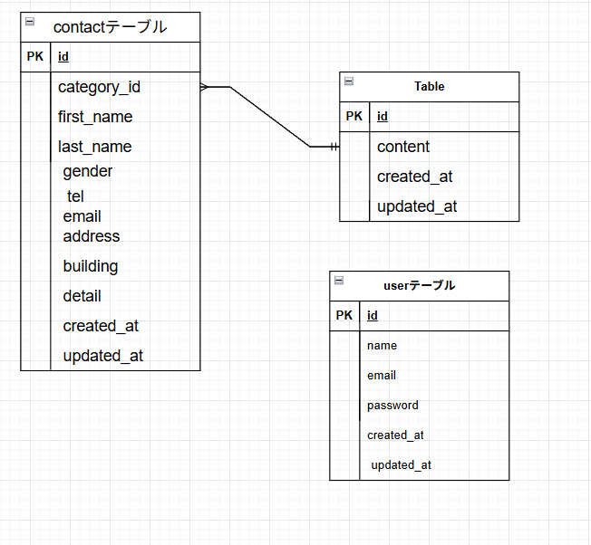

# お問い合わせフォーム
## 環境構築
### Dockerビルド
1. ```git clone git@github.com:matudairatora/contact2.git```
2. ```docker-compose up -d --build```
#### Laravel環境構築
1. ```docker-compose exec php bash```
2. ```composer install```
3. .env.exampleファイルから.envを作成し、環境変数を変更
4. ```php artisan key:generate```
5. ```php artisan migrate:fresh```
6. ```php artisan db:seed```
7. ```exit```
8. ```sudo chmod -R 777 *```

### 使用技術
- PHP 8.0
- Laravel 10.0
- MySQL 8.0

### ER図
- 
### URL
- 開発環境 http://localhost/
- phpMyAdmin http://localhost:8080/